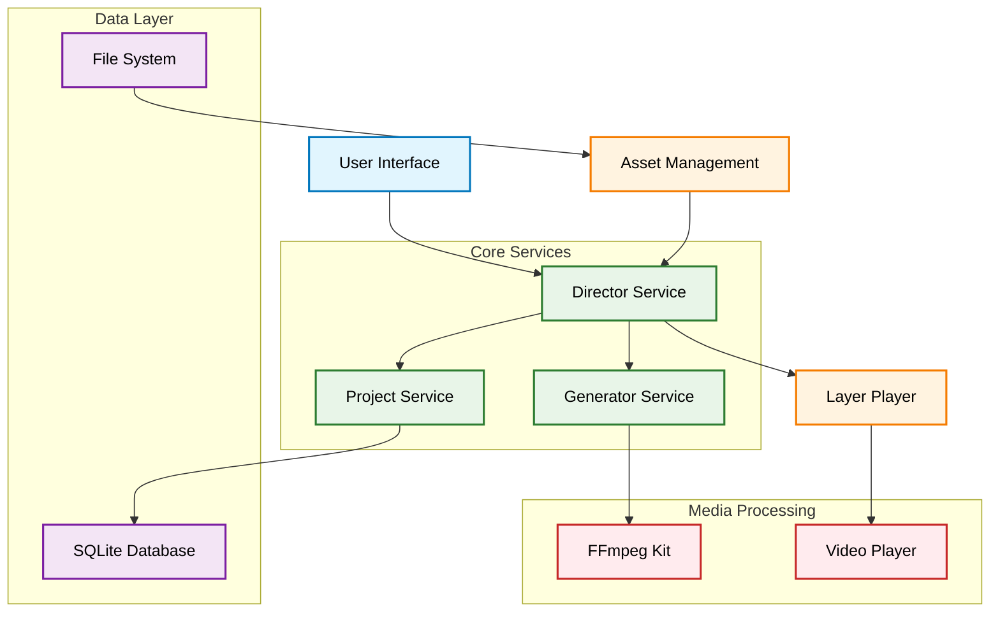
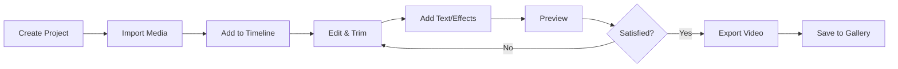

# 🎬 Flutter Video Editor App

A powerful, feature-rich video editing application built with Flutter that provides professional-grade video editing capabilities on mobile devices. This is a modernized fork of [open_director](https://github.com/jmfvarela/open_director), completely migrated to Flutter 3.35.1 with null safety support and updated to use the latest dependencies.

[](https://flutter.dev/)
[](https://dart.dev/)
[](LICENSE)
[](CONTRIBUTING.md)

## 📱 Screenshots & Demo

<div align="center">
  
</div>

_Screenshots coming soon..._

## ✨ Features

### 🎥 Video Editing Capabilities

- **Multi-layer Timeline**: Support for video, audio, image, and text layers
- **Video Trimming & Cutting**: Precise frame-level video cutting and trimming
- **Video Merging**: Combine multiple video clips seamlessly
- **Ken Burns Effect**: Animated zoom and pan effects for images
- **Multiple Resolution Support**: Export videos in various resolutions (SD, HD, etc.)
- **Real-time Preview**: Live preview of edits with smooth playback

### 🖼️ Media Support

- **Video Import**: Support for various video formats
- **Image Integration**: Add images with smooth transitions
- **Font Library**: 20+ beautiful fonts for text overlays
- **Custom Text**: Rich text editing with positioning, colors, and effects

### 🎨 Advanced Editing Features

- **Layer Management**: Independent control of video, audio, image, and text layers
- **Asset Management**: Organized project structure with thumbnail generation
- **Timeline Navigation**: Precise timeline scrubbing and positioning
- **Project Persistence**: Save and resume projects with SQLite database

### 🚀 Modern Technical Features

- **Null Safety**: Full null safety migration for better reliability
- **FFmpeg Integration**: Powered by `ffmpeg_kit_flutter_new` for video processing
- **Reactive Architecture**: Built with RxDart for responsive UI updates
- **State Management**: Clean service locator pattern with GetIt
- **Modern Dependencies**: All packages updated to latest stable versions

## 🛠️ Technical Architecture



## 📋 Video Editing Workflow



## 🚀 Getting Started

### Prerequisites

- Flutter SDK (3.35.1 or later)
- Dart SDK (3.9.0 or later)
- Android Studio / VS Code
- Android SDK (for Android builds)
- Xcode (for iOS builds)

### Installation

1. **Clone the repository**

   ```bash
   git clone https://github.com/ShishirRijal/Flutter-Video-Editor-App.git
   cd Flutter-Video-Editor-App
   ```

2. **Install dependencies**

   ```bash
   flutter pub get
   ```

3. **Run the app**
   ```bash
   flutter run
   ```

### Platform-specific Setup

#### Android

- Minimum SDK: API 21 (Android 5.0)
- Permissions: Storage, Camera (automatically handled)

#### iOS

- Minimum iOS: 11.0
- Permissions: Photo Library, Camera (automatically handled)

## 📱 How to Use

### Creating a New Project

1. Launch the app and tap "Create New Project"
2. Enter project name and description
3. Start adding media assets to your timeline

### Adding Media

- **Videos**: Tap the video icon to import video files
- **Images**: Tap the image icon to add photos
- **Audio**: Tap the audio icon to add background music
- **Text**: Tap the text icon to add text overlays

### Editing Videos

- **Trim**: Select a video asset and use the trim handles
- **Cut**: Position the playhead and tap the cut button
- **Delete**: Select an asset and tap the delete button
- **Move**: Drag assets along the timeline

### Text Editing

- Tap any text asset to edit content
- Customize font, size, color, and position
- Add borders, shadows, and background boxes

### Exporting

1. Tap the save button in the app bar
2. Choose your desired resolution
3. Wait for processing to complete
4. Find your video in the generated videos list

## 🎯 Project Status

### ✅ Completed Features

- ✅ Video import and basic editing
- ✅ Image import with Ken Burns effects
- ✅ Video trimming and cutting
- ✅ Timeline management
- ✅ Project persistence
- ✅ Video export in multiple resolutions
- ✅ Text overlay system
- ✅ Multi-layer support
- ✅ Real-time preview

### 🚧 Work in Progress

- 🔄 Audio editing and mixing improvements
- 🔄 Advanced text effects and animations
- 🔄 More transition effects
- 🔄 Performance optimizations

### 📝 Planned Features

- 🎵 Advanced audio editing and mixing
- 🎨 More visual effects and filters
- 📱 Better mobile UI/UX optimizations
- 🔄 More video transition effects
- 📊 Performance analytics and optimization

## 🏗️ Architecture & Technical Details

### Core Components

#### Director Service

The main orchestrator that manages:

- Timeline state and playback
- Asset management and manipulation
- Layer coordination
- UI state synchronization

#### Generator Service

Handles video processing:

- FFmpeg command generation
- Video rendering and export
- Format conversion and optimization
- Background processing management

#### Layer System

Three-layer architecture:

- **Layer 0**: Raster layer (videos and images)
- **Layer 1**: Vector layer (text and graphics)
- **Layer 2**: Audio layer (background music and sound)

### Dependencies

| Package                  | Version | Purpose                 |
| ------------------------ | ------- | ----------------------- |
| `ffmpeg_kit_flutter_new` | ^3.2.0  | Video processing engine |
| `video_player`           | ^2.9.2  | Video playback          |
| `sqflite`                | ^2.4.2  | Local database          |
| `rxdart`                 | ^0.28.0 | Reactive programming    |
| `file_picker`            | ^10.3.2 | File selection          |
| `path_provider`          | ^2.1.5  | Directory access        |

## 🤝 Contributing

We welcome contributions! This project is actively maintained and open to pull requests.

### How to Contribute

1. **Fork the repository**
2. **Create a feature branch**
   ```bash
   git checkout -b feature/amazing-feature
   ```
3. **Make your changes**
4. **Write tests** (if applicable)
5. **Commit your changes**
   ```bash
   git commit -m 'Add some amazing feature'
   ```
6. **Push to the branch**
   ```bash
   git push origin feature/amazing-feature
   ```
7. **Open a Pull Request**

### Development Guidelines

- Follow Flutter/Dart best practices
- Maintain null safety compliance
- Add documentation for new features
- Test on both Android and iOS
- Update README if needed

### Areas for Contribution

- 🎵 Audio editing improvements
- 🎨 New visual effects
- 📱 UI/UX enhancements
- 🔧 Performance optimizations
- 📖 Documentation improvements
- 🧪 Test coverage
- 🐛 Bug fixes

## 📄 License

This project is licensed under the MIT License - see the [LICENSE](LICENSE) file for details.

## 🙏 Acknowledgments

- Original project: [open_director](https://github.com/jmfvarela/open_director) by jmfvarela
- Flutter team for the amazing framework
- FFmpeg team for the powerful video processing library
- All contributors and community members

## 🚀 Migration Notes

This fork includes several major improvements over the original:

### Technical Upgrades

- ✅ **Flutter 3.35.1**: Latest stable Flutter version
- ✅ **Null Safety**: Complete null safety migration
- ✅ **Modern Dependencies**: All packages updated to latest versions
- ✅ **FFmpeg Kit**: Migrated from deprecated `flutter_ffmpeg` to `ffmpeg_kit_flutter_new`

### Code Improvements

- ✅ **Better Error Handling**: Comprehensive error handling and logging
- ✅ **Performance**: Memory management and performance optimizations
- ✅ **Code Quality**: Improved code structure and documentation
- ✅ **Type Safety**: Enhanced type safety throughout the codebase

---

**Built with ❤️ using Flutter**

_Ready to create amazing videos? Download and start editing today!_
